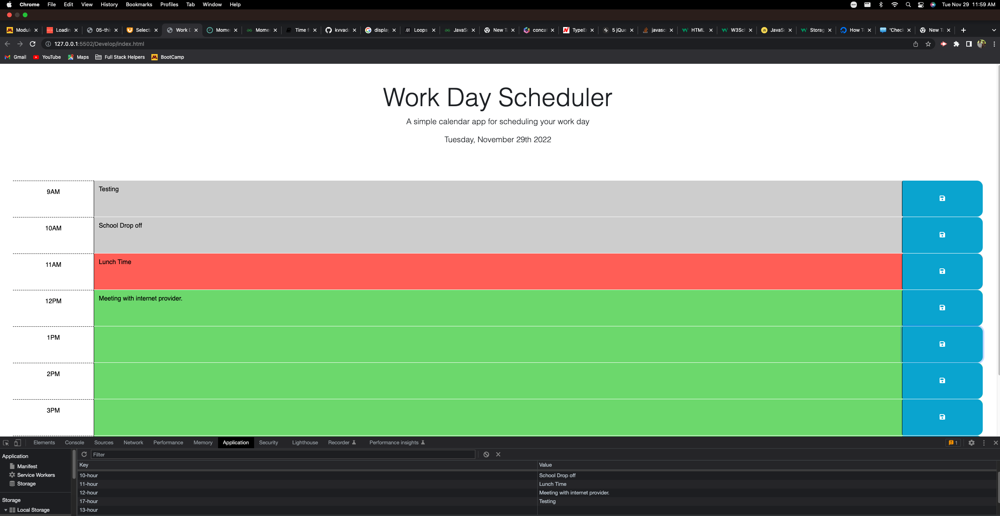

# Work Day Scheduler Application.

## How to access the Work Day Scheduler?
https://kvvadavi.github.io/Module5Challenge/

## What does Work Day Scheduler do?
- This is a simple calendar application that allows a user to save events for each hour of the day. Each time block is color-coded to indicate whether it is in the past, present, or future.
- Once the data for a given time is saved. Data is stored locally to broweser's local storage.
- User can modify the events and save it.

## Screenshot of application.

